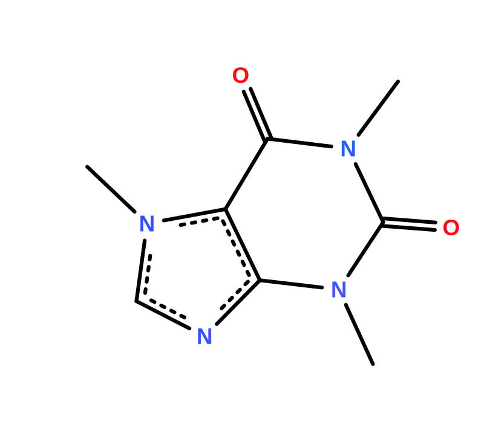
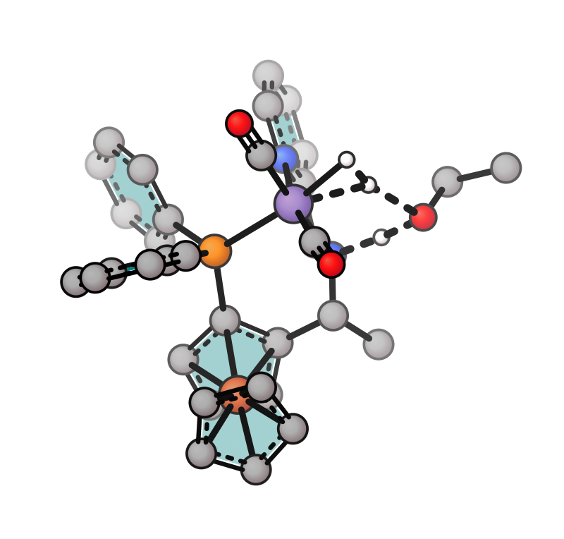
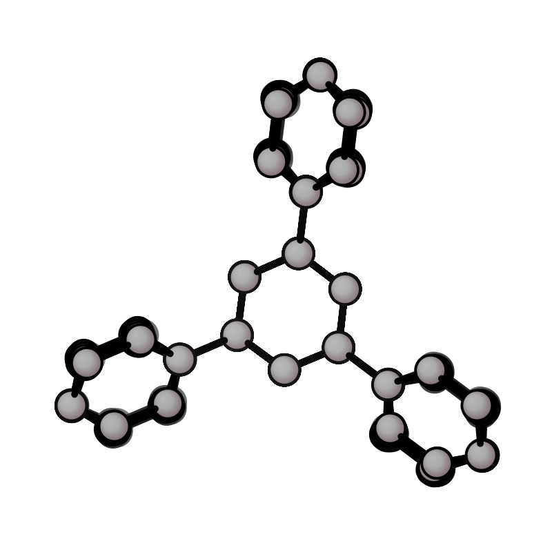
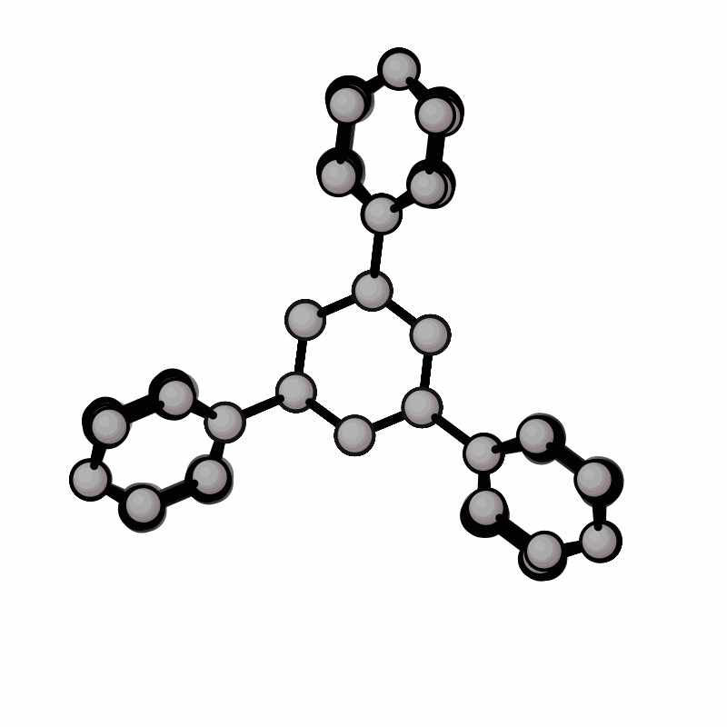

# xyzrender: Publication-quality molecular graphics.

Render molecular structures as publication-quality SVG, PNG, PDF, and animated GIF from XYZ, mol/SDF, MOL2, PDB, SMILES, CIF, cube files, or quantum chemistry output — from the command line or from Python/Jupyter.

[](https://pepy.tech/projects/xyzrender)
[](https://github.com/aligfellow/xyzrender/blob/main/LICENSE)
[](https://docs.astral.sh/uv)
[](https://github.com/astral-sh/ruff)
[](https://github.com/astral-sh/ty)
[](https://github.com/aligfellow/xyzrender/actions)
[](https://codecov.io/gh/aligfellow/xyzrender)
[](https://xyzrender.readthedocs.io/en/latest/)
[](https://xyzrender.readthedocs.io)

xyzrender turns XYZ files and quantum chemistry input/output (MOl, MOL2, SDF, PDB, ORCA, Gaussian, Q-Chem, etc.) into clean SVG, PNG, PDF, and animated GIF graphics — ready for papers, presentations, and supporting information. The SVG rendering approach is built on and inspired by [**xyz2svg**](https://github.com/briling/xyz2svg) by [Ksenia Briling **@briling**](https://github.com/briling).

Most molecular visualisation tools require manual setup: loading files into a GUI, tweaking camera angles, exporting at the right resolution and adding specific TS or NCI bonds. `xyzrender` skips this. One command gives you a (mostly) oriented, depth-cued structure with correct bond orders, aromatic ring rendering, automatic bond connectivity, with TS bonds and NCI bonds. Orientation control is available through an interface to [**v**](https://github.com/briling/v) by [Ksenia Briling **@briling**](https://github.com/briling).

 

**What it handles out of the box:**

- **Bond orders and aromaticity** — double bonds, triple bonds, and aromatic ring notation detected automatically from geometry via [`xyzgraph`](https://github.com/aligfellow/xyzgraph)
- **Transition state bonds** — forming/breaking bonds rendered as dashed lines, detected automatically from imaginary frequency vibrations via [`graphRC`](https://github.com/aligfellow/graphRC)
- **Non-covalent interactions** — hydrogen bonds and other weak interactions shown as dotted lines, detected automatically via [`xyzgraph`](https://github.com/aligfellow/xyzgraph)
- **GIF animations** — rotation, TS vibration, and trajectory animations for presentations
- **Molecular orbitals** — render MO lobes from cube files with front/back depth cueing
- **Electron density surfaces** — depth-graded translucent isosurfaces from density cube files
- **Electrostatic potential (ESP)** — ESP colormapped onto the density surface from paired cube files
- **vdW surface overlays** — van der Waals spheres on all or selected atoms
- **Convex hull** — semi-transparent facets over selected atoms (e.g. aromatic ring carbons, coordination spheres); optional hull-edge lines
- **Depth fog and gradients** — 3D depth cues without needing a 3D viewer
- **Cheminformatics formats** — mol, SDF, MOL2, PDB (with CRYST1 unit cell), SMILES (3D embedding via rdkit), and CIF (via ase) — bond connectivity read directly from file
- **Crystal / periodic structures** — render periodic structures with unit cell box, ghost atoms, and crystallographic axis arrows (a/b/c); extXYZ `Lattice=` auto-detected; VASP/QE via [`phonopy`](https://github.com/phonopy/phonopy)
- **Multiple output formats** — SVG (default), PNG, PDF, and GIF from the same command

**Preconfigured but extensible.** Built-in presets (`default`, `flat`, `paton`) cover common use cases. Every setting — colors, radii, bond widths, gradients, fog — can be overridden via CLI flags or a custom JSON config file.

```bash
xyzrender caffeine.xyz                          # SVG with sensible defaults
xyzrender ts.out --ts -o figure.png             # TS with dashed bonds as PNG
xyzrender caffeine.xyz --gif-rot -go movie.gif  # rotation GIF for slides
```

See web app by [@BNNLab](https://github.com/bnnlab) [**xyzrender-web.streamlit.app**](https://xyzrender-web.streamlit.app/).

## Installation

### From PyPI:  

```bash
pip install xyzrender
```

Or with [uv](https://docs.astral.sh/uv/):

```bash
uv tool install xyzrender
```

To test without installing, you can use [uvx](https://docs.astral.sh/uv/guides/tools/#running-tools)

```bash
uvx xyzrender 
```

### From Source:

Using pip: 

```bash
git clone https://github.com/aligfellow/xyzrender.git
cd xyzrender
pip install .
# install in editable mode
pip install -e .
# or straight from git
pip install git+https://github.com/aligfellow/xyzrender.git
```

Or if you'd rather use [uv](https://docs.astral.sh/uv/):

```bash
git clone https://github.com/aligfellow/xyzrender.git
cd xyzrender
uv tool install .
# install in editable mode
uv tool install --editable .
# or straight from git
uv tool install git+https://github.com/aligfellow/xyzrender.git
```

## Quick start

```bash
# Render from XYZ file (writes caffeine.svg by default)
xyzrender caffeine.xyz

# Render from QM output (ORCA, Gaussian, Q-Chem, etc.)
xyzrender calc.out

# Explicit output path — extension controls format
xyzrender caffeine.xyz -o render.png
xyzrender caffeine.xyz -o render.pdf

# Pipe from stdin (writes graphic.svg)
cat caffeine.xyz | xyzrender
```

Output defaults to `{input_basename}.svg`. Use `-o` to specify a different path or format.

## Python API

xyzrender has a full Python API. Results display inline in Jupyter automatically.

### Quick start

```python
from xyzrender import load, render, render_gif, build_config, measure

# Load once — render many times without re-parsing the file
mol = load("caffeine.xyz")
render(mol)                         # displays inline in Jupyter
render(mol, output="caffeine.svg")  # save as SVG
render(mol, output="caffeine.png")  # save as PNG

# Short-form: pass a path directly (loads with defaults each time)
render("caffeine.xyz")
smi = load("C1CC(O)CCC1O", smiles=True)
smi.to_xyz("smiles.xyz")
```

### Render options

All CLI flags are available as keyword arguments to `render()`:

```python
# Styling
render(mol, config="flat")                         # built-in preset
render(mol, bond_width=8, atom_scale=1.5, background="#f0f0f0")

# Hydrogen visibility (1-indexed atom numbers)
ethanol = load("ethanol.xyz")
render(ethanol, hy=True)                           # show all H
render(ethanol, no_hy=True)                        # hide all H
render(ethanol, hy=[7, 8, 9])                      # show specific H

# Overlays
render(mol, vdw=True)                              # vdW spheres on all atoms
render(mol, vdw=[1, 3, 5])                         # vdW spheres on specific atoms
render(mol, ts_bonds=[(1, 6)])                     # manual TS bond (1-indexed)
render(mol, nci_bonds=[(2, 8)])                    # manual NCI bond (1-indexed)
render(mol, idx=True)                              # atom index labels ("C1", "N3", …)
render(mol, idx="n")                               # index only ("1", "3", …)

# Structural overlay
mol1 = load("isothio_xtb.xyz", charge=1)
mol2 = load("isothio_uma.xyz", charge=1)
render(mol1, overlay=mol2)                         # overlay mol2 onto mol1
render(mol1, overlay=mol2, overlay_color="green")  # custom overlay color
render_gif(mol1, overlay=mol2, gif_rot="y")        # spinning overlay GIF

# Annotations
render(mol, labels=["1 2 d", "1 2 3 a"])           # inline spec strings
render(mol, label_file="annot.txt")                # bulk annotation file

# Atom property colormap (1-indexed dict, or path to a two-column file)
render(mol, cmap={1: 0.5, 2: -0.3}, cmap_range=(-1.0, 1.0))
render(mol, cmap="charges.txt", cmap_range=(-1.0, 1.0))

# Surfaces (cube files)
mol_cube = load("caffeine_homo.cube")
render(mol_cube, mo=True)                          # MO lobes
render(mol_cube, mo=True, iso=0.03, mo_pos_color="maroon", mo_neg_color="teal")

dens_cube = load("caffeine_dens.cube")
render(dens_cube, dens=True)                       # density isosurface
render(dens_cube, esp="caffeine_esp.cube")         # ESP mapped onto density
render(dens_cube, nci="caffeine_grad.cube")        # NCI surface

# Convex hull (1-indexed atom indices for subsets, e.g. ring carbons)
render(mol, hull=[1, 2, 3, 4, 5, 6],
       hull_color="steelblue", hull_opacity=0.35)
```

### Reusing a style config

Build a `RenderConfig` once and apply it to many molecules - useful in notebooks or scripts that render several structures with the same style:

```python
cfg = build_config("flat", atom_scale=1.5, gradient=False)
render(mol1, config=cfg)
render(mol2, config=cfg, ts_bonds=[(1, 6)])   # per-render overlay on shared style
render_gif("mol.xyz", gif_rot="y", config=cfg)
```

### Geometry measurements

`measure()` returns bonded distances, angles, and dihedrals as a dict (does not render):

```python
data = measure(mol)                    # all measurements
data = measure("mol.xyz")              # also accepts a path
data = measure(mol, modes=["d", "a"])  # distances and angles only

for i, j, d in data["distances"]:
    print(f"  {i+1}-{j+1}: {d:.3f} Å")
```

### Loading options

Use `load()` explicitly when you need non-default loading behaviour:

```python
mol = load("ts.out", ts_detect=True)            # detect TS bonds via graphRC
mol = load("mol.xyz", nci_detect=True)          # detect NCI interactions
mol = load("mol.sdf", mol_frame=2, kekule=True) # SDF frame + Kekule bonds
mol = load("CC(=O)O", smiles=True)              # SMILES → 3D (requires rdkit)
mol = load("POSCAR", crystal=True)              # VASP/QE structure (requires phonopy)
mol = load("caffeine_cell.xyz", cell=True)      # extXYZ Lattice= header
mol = load("mol.xyz", quick=True)               # skip BO detection (faster, use with bo=False)
```

### Saving geometry

`Molecule.to_xyz()` writes the structure to an XYZ file. If the molecule has `cell_data` (loaded with `cell=True` or `crystal=...`), the output is extXYZ with a `Lattice=` header so it can be reloaded directly. Ghost atoms are excluded.

```python
mol = load("CC(=O)O", smiles=True)   # embed SMILES into 3D
mol.to_xyz("acetic_acid.xyz")         # plain XYZ
mol.to_xyz("acetic_acid.xyz", title="acetic acid")  # with comment line

mol_cell = load("caffeine_cell.xyz", cell=True)
mol_cell.to_xyz("out.xyz")            # extXYZ with Lattice= header
```

`--smi` in the CLI also saves the embedded geometry to an XYZ file automatically alongside the rendered image.

### Interactive orientation

`orient()` opens the 3D viewer ([**v**](https://github.com/briling/v)) so you can rotate a molecule manually, then locks the orientation for subsequent `render()` calls:

```python
from xyzrender import load, orient, render

mol = load("caffeine.xyz")
orient(mol)        # opens viewer — rotate, close to confirm
render(mol)        # renders in the manually chosen orientation
render(mol, output="caffeine.svg")
```

### GIF animations

```python
render_gif("caffeine.xyz", gif_rot="y")           # rotation GIF
render_gif("ts.out", gif_ts=True)                 # TS vibration GIF
render_gif("traj.xyz", gif_trj=True)              # trajectory GIF
render_gif("mol.xyz", gif_rot="y", config=cfg)    # with shared style config

# Surface in rotation GIF (cube file)
mol_cube = load("caffeine_homo.cube")
render_gif(mol_cube, gif_rot="y", mo=True, output="homo_rot.gif")
```

### SVGResult / GIFResult

`render()` returns an `SVGResult`; `render_gif()` returns a `GIFResult`.
Both display inline in Jupyter automatically, and both support `.save()`:

```python
result = render(mol)
str(result)              # raw SVG string
result.save("out.svg")   # write to file

gif = render_gif("mol.xyz", gif_rot="y")
gif.path                 # pathlib.Path to the GIF on disk
gif.save("copy.gif")     # copy to another path
```

See [`examples/examples.ipynb`](examples/examples.ipynb) for a runnable notebook.

## CLI Examples

Sample structures are in [`examples/structures/`](examples/images/structures/). Rendered outputs and the generation script are in [`examples/`](examples/images/). To regenerate all outputs:

```bash
uv run bash examples/generate.sh
```

### Presets

| Default | Flat | Paton (pymol-like) | Skeletal |
|---------|------|--------------------|----------|
|  |  |  |  |

```bash
xyzrender caffeine.xyz -o caffeine_default.svg              # default preset
xyzrender caffeine.xyz --config flat -o caffeine_flat.svg   # flat: no gradient
xyzrender caffeine.xyz --config paton -o caffeine_paton.svg # paton: PyMOL-style
xyzrender caffeine.xyz --config skeletal -o caffeine_skeletal.svg # skeletal formula diagram
```

The `paton` style is inspired by the clean styling used by [Rob Paton](https://github.com/patonlab) through PyMOL (see [gist](https://gist.github.com/bobbypaton/1cdc4784f3fc8374467bae5eb410edef))

### Display options

| All H | Some H | No H | 
|-------|--------|------|
|  |  |  | 

| Aromatic | Kekule |
|----------|--------|
|  |  |

```bash
xyzrender ethanol.xyz --hy -o ethanol_all_h.svg         # all H
xyzrender ethanol.xyz --hy 7 8 9 -o ethanol_some_h.svg  # specific H atoms
xyzrender ethanol.xyz --no-hy -o ethanol_no_h.svg       # no H
xyzrender benzene.xyz --hy -o benzene.svg               # aromatic
xyzrender caffeine.xyz --bo -k -o caffeine_kekule.svg   # Kekule bond orders
```

### vdW spheres

| All atoms | Some vdW | paton-style |
|-----------|--------|--------|
|  |  |  |

```bash
xyzrender asparagine.xyz --hy --vdw -o asparagine_vdw.svg  # vdW spheres on all atoms
xyzrender asparagine.xyz --hy --vdw "1-6" -o asparagine_vdw_partial.svg  # vdW spheres on some atoms
xyzrender asparagine.xyz --hy --vdw --config paton -o asparagine_vdw_paton.svg  # vdW spheres on all atoms
```

### Convex hull

Draw the convex hull of selected atoms as semi-transparent facets — useful for aromatic rings, coordination spheres, or any subset of atoms. Facets are depth-sorted for correct occlusion. Hull edges that do not coincide with bonds are drawn as thin lines for better 3D perception; disable with `--no-hull-edge`.

| Benzene ring | Anthracene rings | CoCl₆ octahedron |
|--------------|------------------|------------------|
|  |  |  |

| Anthracene ring | Anthracene rot | Auto rings (`hull="rings"`) |
|--------------|------------------|----------------------------|
|  |  |  |

```bash
# Single subset (1-indexed atom range):
xyzrender benzene.xyz --hull 1-6 -o benzene_ring_hull.svg

# All heavy atoms:
xyzrender anthracene.xyz --hull -o anthracene_hull_one.svg

# Multiple subsets with per-hull colors:
xyzrender anthracene.xyz --hull 1-6 4,6-10 8,10-14 -o anthracene_hull.svg

# Auto-detect aromatic rings (one hull per ring, colours cycle unless a single hull-color passed):
xyzrender mn-h2.log --ts --hull rings --hull-color teal -o mnh_hull_rings.svg
```

```python
# Single subset (1-indexed):
render(mol, hull=[1, 2, 3, 4, 5, 6],
       hull_color="steelblue", hull_opacity=0.35, output="benzene_ring_hull.svg")

# Multiple subsets with per-subset colors (1-indexed):
render(mol, hull=[[1, 2, 3, 4, 5, 6], [7, 8, 9, 10, 11, 12]],
       hull_color=["steelblue", "coral"], hull_opacity=0.35,
       output="anthracene_hull.svg")

# Auto-detect aromatic rings — each ring gets its own hull:
render(mol, hull="rings", hull_color="teal")
```

**Options (passed to `render()`):**

| Option | Description |
|--------|-------------|
| `hull` | `True` = all heavy atoms; `"rings"` = auto-detect aromatic rings (one hull per ring); flat list = one subset; list of lists = multiple hulls |
| `hull_color` | Single string or list of strings for per-subset colours (default palette cycles automatically) |
| `hull_opacity` | Fill opacity for all hull surfaces |
| `hull_edge` | Draw non-bond hull edges as thin lines (default: `True`) |
| `hull_edge_width_ratio` | Edge stroke width as fraction of bond width |

### Structural overlay

Overlay two conformers or geometries to compare them. The second structure is RMSD-aligned onto the first via the Kabsch algorithm using index-based atom pairing, and rendered in a contrasting colour. Both molecules must have the same number of atoms in the same order.

| Default | Custom colour | Rotation GIF |
|---------|---------------|--------------|
|  |  |  |

```bash
xyzrender isothio_xtb.xyz --overlay isothio_uma.xyz -c 1 --hy -o isothio_overlay_rot.svg --gif-rot -go isothio_overlay.gif
xyzrender isothio_xtb.xyz --overlay isothio_uma.xyz -c 1 --overlay-color green -a 2 --no-orient -o isothio_overlay_custom.svg
```

### Ensemble overlay

Render all conformers from a multi-frame XYZ trajectory in a single image. All frames are RMSD-aligned onto the first via the Kabsch algorithm (index-based atom pairing), and rendered with the standard CPK colour scheme.

```bash
xyzrender examples/structures/sn2.v000.xyz --ensemble -o sn2_ensemble.svg
```

| SN2 ensemble | Triphenylbenzol ensemble |
|--------------|--------------------------|
|  |  |

| Triphenylbenzol ensemble (static) | Triphenylbenzol ensemble (rotation GIF) |
|-----------------------------------|-----------------------------------------|
|  |  |

### Transition states and NCI

xyzrender uses [xyzgraph](https://github.com/aligfellow/xyzgraph) for molecular graph construction from Cartesian coordinates — determining bond connectivity, bond orders, detecting aromatic rings, and non-covalent interactions. It also provides element data (van der Waals radii, atomic numbers) used throughout rendering.

Transition state analysis uses [graphRC](https://github.com/aligfellow/graphRC) for internal coordinate vibrational mode analysis. Given a QM output file (ORCA, Gaussian, etc.), graphRC identifies which bonds are forming or breaking at the transition state with `--ts`. These are rendered as dashed bonds. graphRC is also used to generate TS vibration frames for `--gif-ts` animations.

NCI detection uses [xyzgraph](https://github.com/aligfellow/xyzgraph)'s `detect_ncis` to identify hydrogen bonds, halogen bonds, pi-stacking, and other non-covalent interactions from geometry. These are rendered as dotted bonds. For pi-system interactions (e.g. pi-stacking, cation-pi), centroid dummy nodes are placed at the mean position of the pi-system atoms. For trajectory GIFs with `--nci`, interactions are re-detected per frame.

| Auto TS | Manual TS bond |
|------|----------------|
|  |  |

```bash
xyzrender sn2.out --hy --ts -o sn2_ts.svg
xyzrender sn2.out --hy --ts-bond "1-2" -o sn2_ts_man.svg  # specific TS bond only
```

| Auto NCI | Manual NCI |
|------|----------------|
|  |  |

```bash
xyzrender Hbond.xyz --nci -o nci.svg                # auto-detect all NCI interactions
xyzrender Hbond.xyz --nci-bond "8-9" -o nci_man.svg  # specific NCI bond only
```

### QM output files

| ORCA | Gaussian (TS) |
|------|----------------|
|  |  |

```bash
xyzrender bimp.out -o bimp_qm.svg             # ORCA output
xyzrender mn-h2.log -o mn-h2_qm.svg --ts      # Gaussian log with TS detection
```

### Measurements & annotations

#### Bond measurements (`--measure`)

Print bonded distances, angles, and dihedral angles to stdout as a formatted table. This is terminal-only — the SVG is still rendered as normal.

```bash
xyzrender ethanol.xyz --measure 
xyzrender ethanol.xyz --measure d # bonded distances only (a for angles, t for torsion/dihedral)
```

```text
Bond Distances:
     C1 - C2     1.498Å
     C1 - H4     1.104Å
     ...
Bond Angles:
     C2 - C1 - H5     109.62°
     C2 - C1 - H6     111.98°
     ...
Dihedral Angles:
     H5 - C1 - C2 - O3      -55.99°
     H5 - C1 - C2 - H7     -177.53°
     ...
```

- `d`, `a` and `t` can be combined
- *e.g.* `--measure d a` prints bonds and angles only

#### Atom index labels (`--idx`)

Add atom index labels centred on every atom in the SVG. Three format options:

| Index + symbol | Index only |
|----------------|------------|
|  |  |

```bash
xyzrender caffeine.xyz --idx                          # symbol + index
xyzrender caffeine.xyz --hy --idx n --label-size 25   # index only
xyzrender caffeine.xyz --hy --idx s                   # symbols only
```

#### SVG annotations (`-l` / `--label`) 

Annotate specific bonds, angles, atoms, or dihedrals with computed or custom text. The **last token** of each spec determines its type. All atom indices are **1-based**.

| Spec | SVG output |
|------|------------|
| `-l 1 2 d` | Distance text at the 1–2 bond midpoint |
| `-l 1 d` | Distance text on every bond incident to atom 1 |
| `-l 1 2 3 a` | Arc at atom 2 (the vertex) + angle value text |
| `-l 2 a` | Arc + value for all angles where atom 2 is the vertex |
| `-l 1 2 3 4 t` | Colored line 1-2-3-4 + dihedral value near bond 2–3 |
| `-l 1 +0.512` | Custom text near atom 1 |
| `-l 1 2 NBO` | Custom text at the 1–2 bond midpoint |

| distances + angles + dihedrals | custom annotation | 
|-------------------|-------------------|
|  |  | 


```bash
xyzrender caffeine.xyz -l 13 6 9 4 t -l 1 a -l 14 d -l 7 12 8 a -l 11 d
xyzrender caffeine.xyz -l 1 best -l 2 "NBO: 0.4"
```

- `-l` is repeatable  
- For explicit bond pairs (`i j d`) with no actual bond edge in the graph, a warning is printed and the label is placed at the midpoint anyway  
  - useful for hydrogen-bond or contact distances.

**Bulk annotation file** (`--label FILE`):

Same syntax, per line. Lines whose first token is not an integer (e.g. CSV headers) are silently skipped, so df can be written directly to file. Comment lines (#) are okay, quoted labels are okay (*e.g.* "pKa: 5")

| Label file |
|---------------------|
|  |

```
# sn2_charges.txt — comma or whitespace separated,
2 1 d 
1 22 d
2 1 22 a
```

```bash
xyzrender sn2.out --ts --label sn2_label.txt --label-size 40
```

#### Atom property colormap (`--cmap`)

Color atoms by a per-atom scalar value using a Viridis-like colormap. Useful for partial charges, and any other atomic property.

| Mulliken charges | Symmetric range |
|------------------|------------------| 
|  |  | 


The colormap file has two columns - **1-indexed atom number** and value. Any extension works (*e.g.* `.txt`, `.csv`) as long as this file is comma or whitespace separated. Header lines (any line whose first token is not an integer) are silently skipped. Comment and blank lines (`#`) are also skipped.

```
# charges.txt — whitespace or comma separated
1  +0.512
2  -0.234
3   0.041
```

```bash
xyzrender caffeine.xyz --hy --cmap caffeine_charges.txt --gif-rot
xyzrender caffeine.xyz --hy --cmap caffeine_charges.txt --cmap-range -0.5 0.5
```

- Atoms **in the file**: colored by Viridis-like colormap (dark purple → blue → green → yellow-green → bright yellow). This colormap never passes through white.
- Atoms **not in the file**: white (`#ffffff`). White is never a Viridis output, so is unambiguously *not mapped*. The unlabeled color can be overridden via `"cmap_unlabeled"` in a custom preset JSON.
- Range defaults to the min/max of provided values; override with `--cmap-range vmin vmax`. Use this for a symmetric colour scale.

### GIF animations

| Rotation (y) | Rotation (xy) |
|--------------|---------------|
|  |  |

| TS vibration + rotation | TS vibration | Trajectory |
|-------------------------|--------------|------------|
|  |  |  |

```bash
xyzrender caffeine.xyz --gif-rot -go caffeine.gif                          # rotation (y-axis)
xyzrender caffeine.xyz --gif-rot xy -go caffeine_xy.gif                    # rotation (xy axes)
xyzrender bimp.out --gif-rot --gif-ts --vdw 84-169 -go bimp.gif           # TS vibration + rotation
xyzrender mn-h2.log --gif-ts -go mn-h2.gif                                # TS vibration
xyzrender bimp.out --gif-trj --ts -go bimp_trj.gif                        # trajectory with TS bonds
```

GIF defaults to `{input_basename}.gif`. Use `-go` to override.

### Combined options

The visualisation supports most combinations of these options.  
- `--gif-ts` and `--gif-trj` are *mutually exclusive*

| TS animation | trj animation |
|--------------|---------------|
|  |  |

```bash
xyzrender bimp.out --gif-ts --gif-rot --nci --vdw 84-169 -go bimp_nci_ts.gif  # TS animation + nci + vdW + rotate
xyzrender bimp.out --gif-trj --nci --ts --vdw 84-169 -go bimp_nci_trj.gif  # TS bonds + nci + vdW + trj
```


### File formats

xyzrender reads bond connectivity where present directly from mol, SDF, MOL2, PDB, SMILES, and CIF files. Parser is dictated by file extension.

```bash
xyzrender examples/structures/caffeine_sdf.sdf  # SDF — bonds from file
xyzrender examples/structures/water_mol2.mol2   # MOL2 — Tripos aromatic bonds
xyzrender examples/structures/ala_phe_ala.pdb   # PDB — ATOM/HETATM + CONECT
xyzrender examples/structures/caffeine_cif.cif  # CIF — crystal structure via ase
xyzrender --smi "C1CCCCC1" --hy -o cyclohexane_smi.svg  # SMILES — 3D embedding via rdkit
```

| PDB | SMILES |
|-----------|---------------|
|  |  |

- ala_phe_ala.pdb from [here](https://gist.github.com/cstein/66992000)

**PDB with CRYST1:** if the PDB contains a `CRYST1` record, the unit cell is parsed and the crystal rendering path is used automatically (cell box, same as `--cell`).
**SMILES (`--smi`):** embeds a SMILES string into 3D using rdkit (ETKDGv3 + MMFF94). An XYZ file of the optimised geometry is written alongside the output image automatically.

  - SMILES requires `pip install xyzrender[smiles]` (rdkit). 
  - CIF requires `pip install 'xyzrender[cif]'` (ase).

**Multi-record SDF:** use `--mol-frame N` to select a record (default: 0).
```bash
xyzrender examples/structures/multi_mol.sdf --mol-frame 1
```

**Re-detect bonds:** `--rebuild` discards file connectivity and runs xyzgraph distance-based detection instead.

Format-specific flags:

| Flag | Description |
|------|-------------|
| `--smi SMILES` | Embed a SMILES string into 3D (requires rdkit) |
| `--mol-frame N` | Record index in multi-molecule SDF (default: 0) |
| `--rebuild` | Ignore file connectivity; re-detect bonds with xyzgraph |

### Crystal structures / unit cell

Draw the unit cell box for periodic structures from an **extXYZ** file with a `Lattice=` header. The cell is detected automatically — no extra flag needed.

| Unit cell | Cell rotation | Custom |
|-----------|---------------|--------|
|  |  |  |

| Default | No ghost atoms | No cell box |
|---------|----------------|-------------|
|  |  |  |


```bash
xyzrender caffeine_cell.xyz -o caffeine_cell.svg                            # unit cell box (auto-detected)
xyzrender caffeine_cell.xyz --gif-rot -go caffeine_cell.gif                 # rotation GIF with cell
xyzrender caffeine_cell.xyz --cell-color maroon -o caffeine_cell_custom.svg # custom edge color
xyzrender NV63_cell.xyz -o NV63_cell.svg  # extXYZ, hide ghost atoms
xyzrender NV63_cell.xyz --no-ghosts --no-axes -o NV63_cell_no_ghosts.svg  # extXYZ, hide ghost atoms, hide crystallographic axes
xyzrender NV63_cell.xyz --no-cell -o NV63_cell_no_cell.svg   # extXYZ, hide unit cell box
```

The input must be an **extXYZ** file - a standard XYZ file whose comment line (line 2) contains a `Lattice=` key:

```
100
Lattice="14.8 0.0 0.0 0.0 16.7 0.0 -0.484 0.0 3.940" Properties=species:S:1:pos:R:3 ...
C   3.137   3.716   3.547
...
```

The `Lattice=` value is the 3×3 cell matrix as nine space-separated floats: **a**, **b**, **c**. An optional `Origin=` key (e.g. `Origin="0.5 0.5 0.5"`) shifts the cell origin (default: `0 0 0`). Tools like [ASE](https://ase-lib.org/) can export to extXYZ from CIF or other periodic formats.  

We can also handle nine space-separated float values *e.g.*:  
```
100
14.8 0.0 0.0 0.0 16.7 0.0 -0.484 0.0 3.940
C   3.137   3.716   3.547
...
```

Note:  
- **Bond orders are disabled by default** for periodic structures — geometry-based perception is not PBC-aware. Pass `--bo` to re-enable.

The unit cell box is drawn in the background and crystallographic axis arrows (**a**, **b**, **c**) are overlaid on top. Periodic ghost/image atoms — those from neighbouring cells that bond across the cell boundary — are drawn at half opacity so the cell contents are clear. Use `--no-ghosts` to hide them.

> [!NOTE]
> **Ghost bond detection** uses the same bonding distance thresholds from `xyzgraph` but without further geometric validation.

### Crystal / periodic structures

Render VASP (`POSCAR`/`CONTCAR`, `.vasp`) and Quantum ESPRESSO (`.in`) unit cell structures.

> [!NOTE]
> **phonopy is only required for `--crystal`** (loading VASP/QE structure files). Everything else — `--cell` (extXYZ), CIF (ase), PDB CRYST1, ghost atoms, `--axes`, `--axis` — works without it.
> Use `pip install xyzrender[crystal]` or `pip install -e .[crystal]`.

File format is auto-detected from extension (`.vasp`, `POSCAR`, `CONTCAR` → VASP; `.in` → QE). Pass the format explicitly with `--crystal vasp` or `--crystal qe`.

| Default | gif |
|---------|-----|
|  |  |

```bash
xyzrender NV63.vasp --crystal vasp -o NV63_vasp.svg               # VASP (phonopy)
xyzrender NV63.in --crystal qe -o NV63_qe.svg                 # QE (phonopy), hide axes
xyzrender NV63.vasp --crystal -o --gif-rot -go NV63_vasp.gif # auto-detected as VASP
```

An extXYZ file exported from a periodic structure (e.g. via ASE) works directly — the `Lattice=` header is detected automatically and the cell box, ghost atoms, and axis arrows are all enabled without `--crystal` or `--cell`.

#### Crystallographic viewing direction (`--axis`)

Orient the crystal looking down a given crystallographic direction. The `--axis` argument takes a 3-digit Miller index string (each digit is one index, 0–9):

| View along [001] (default) | View along [111] |
|----------------------------|------------------|
|  |  |

```bash
xyzrender NV63_cell.xyz --axis 001 -o NV63_001.svg   # looking down [001]
xyzrender NV63_cell.xyz --axis 111 -o NV63_111.svg   # looking down [111]
```

For GIF rotation around a crystallographic axis, pass the same Miller index string to `--gif-rot`:

| Rotate around [111] |
|---------------------|
|  |

```bash
xyzrender NV63_cell.xyz --axis 111 --gif-rot 111 -o NV63_111.svg -go NV63_111.gif
```

Crystal-specific flags:

| Flag | Description |
|------|-------------|
| `--crystal [{vasp,qe}]` | Load VASP/QE structure via `phonopy`; format auto-detected or explicit |
| `--cell` | Force cell rendering for extXYZ (usually not needed — `Lattice=` auto-detected) |
| `--no-cell` | Hide the unit cell box |
| `--ghosts` / `--no-ghosts` | Show/hide ghost (periodic image) atoms outside the cell |
| `--axes` / `--no-axes` | Show/hide the a/b/c axis arrows (default: shown for periodic structures) |
| `--cell-color` | Unit cell box color (hex or named, default: `gray`) |
| `--cell-width` | Unit cell box line width (default: 2.0) |
| `--ghost-opacity` | Opacity of ghost atoms/bonds (default: 0.5) |
| `--axis HKL` | Orient looking down a crystallographic direction (e.g. `111`, `001`) |

### Molecular orbitals

Render molecular orbitals from cube files (`.cube`). Requires the `--mo` flag. The cube file contains both the molecular geometry and a 3D volumetric grid of orbital values so no separate XYZ file needed.

| HOMO | LUMO | 
|------|------|
|  |  | 

| HOMO + H (iso 0.03) | HOMO rotation |
|---------------------|---------------|
| |  |


```bash
xyzrender caffeine_homo.cube --mo -o caffeine_homo.svg              # HOMO
xyzrender caffeine_lumo.cube --mo --mo-colors maroon teal -o caffeine_lumo.svg  # LUMO
xyzrender caffeine_homo.cube --mo --hy --iso 0.03 -o homo_iso_hy.svg  # MO + H atoms + custom isovalue
xyzrender caffeine_homo.cube --mo --gif-rot -go caffeine_homo.gif   # rotation GIF with MO
```

These cube files should be made separately, *e.g.* with [ORCA](https://www.faccts.de/docs/orca/6.1/manual/contents/utilitiesvisualization/utilities.html?q=orca_plot&n=0#orca-plot):
```bash
orca_plot caffeine.out -i 
```

MO-specific flags:

| Flag | Description |
|------|-------------|
| `--mo` | Enable MO lobe rendering (required for `.cube` input) |
| `--iso` | Isosurface threshold (default: 0.05, smaller = larger lobes) |
| `--opacity` | Surface opacity multiplier (default: 1.0) |
| `--mo-colors POS NEG` | Lobe colors as hex or [named color](https://matplotlib.org/stable/gallery/color/named_colors.html) (default: `steelblue` `maroon`) |
| `--mo-blur SIGMA` | Gaussian blur sigma for lobe smoothing (default: 0.8, ADVANCED)  |
| `--mo-upsample N` | Upsample factor for contour resolution (default: 3, ADVANCED) |
| `--flat-mo` | Disable depth classification — render all lobes as front-facing |

Cube files are typically generated by ORCA (`orca_plot` block) or Gaussian (`cubegen`).

When `--mo` is used with auto-orientation (the default), the molecule is tilted 45 degrees around the x-axis after alignment. This separates orbital lobes above and below the molecular plane so they are clearly visible in the 2D projection. Use `--no-orient` to disable this and render in the raw cube file coordinates or `--interactive` for orientation with [`v`](https://github.com/briling/v) (below).

This has been tested using MO cube files generated from ORCA (see the [**documentation**](https://www.faccts.de/docs/orca/6.1/manual/contents/utilitiesvisualization/utilities.html?q=cube&n=1#orca-plot) for more information).

### Electron density surface

> These surface plots are schematic 2D representations suitable for figures. For quantitative isosurface analysis, use a dedicated 3D viewer.

Render electron density isosurfaces from cube files (`.cube`). Uses `--dens` instead of `--mo`. The density surface is rendered as a depth-graded translucent shell — multiple concentric contour rings are stacked with partial opacity so the centre (high density) appears more opaque than the edges.

| Density surface | Density (iso 0.01) |
|-----------------|-------------------|
|  |  |

| Custom styling | Density rotation |
|---------------|-----------------|
|  |  |

```bash
xyzrender caffeine_sp_dens.cube --dens -o caffeine_dens.svg                                   # density surface
xyzrender caffeine_sp_dens.cube --dens --iso 0.01 -o caffeine_dens_iso.svg                    # larger isovalue (smaller surface)
xyzrender caffeine_sp_dens.cube --dens --dens-color teal --opacity 0.75 -o caffeine_dens_styled.svg  # custom color and opacity
xyzrender caffeine_sp_dens.cube --dens --gif-rot -go caffeine_dens.gif                        # rotation GIF
```

This has been tested using density cube files generated from ORCA (see the [**documentation**](https://www.faccts.de/docs/orca/6.1/manual/contents/utilitiesvisualization/utilities.html?q=cube&n=1#orca-plot) for more information).

Density-specific flags:

| Flag | Description |
|------|-------------|
| `--dens` | Enable density isosurface rendering (requires `.cube` input) |
| `--iso` | Isosurface threshold (default: 0.001) |
| `--dens-color` | Surface color as hex or [named color](https://matplotlib.org/stable/gallery/color/named_colors.html) (default: `steelblue`) |
| `--opacity` | (Surface opacity multiplier, default: 1.0) |

Density cube files contain total electron density on a 3D grid. These can be generated with ORCA (`orca_plot` with density mode) or Gaussian (`cubegen` with `density`). `--dens` and `--mo` are mutually exclusive.

### Electrostatic potential (ESP) surface

Map electrostatic potential onto the electron density isosurface using two cube files: a density cube (main input) and an ESP cube (`--esp` argument). Both must come from the same calculation (identical grid dimensions).

The surface is colored using a diverging colormap centered at zero: blue (positive ESP / electron-poor) through green (zero) to red (negative ESP / electron-rich).

| ESP surface | ESP custom |  
|-------------|-------------|  
|  |  |  

```bash
xyzrender caffeine_dens.cube --esp caffeine_esp.cube -o caffeine_esp.svg
xyzrender caffeine_dens.cube --esp caffeine_esp.cube --iso 0.005 --opacity 0.75 -o caffeine_esp_custom.svg
```

ESP-specific flags:

| Flag | Description |
|------|-------------|
| `--esp CUBE` | ESP cube file path (implies density surface rendering) |
| `--opacity` | (Surface opacity multiplier, default: 1.0) |
| `--iso` | Density isosurface threshold (default: 0.01) |

`--esp` is mutually exclusive with `--mo`, `--dens`, and `--vdw`.
`--gif-rot` is **not available**; however, the `-I` flag allows for interactive orientation of the molecule prior to generating the image.

### Vector arrows

Overlay arbitrary 3D vectors as arrows on the rendered image via a JSON file. Useful for dipole moments, forces, electric fields, transition vectors, etc.

| Dipole moment | Rotation |  
|-------------|-------------|  
|  |  |  


```bash
xyzrender ethanol.xyz --vector ethanol_dip.json -o ethanol_dip.svg
```

Each entry in the JSON array defines one arrow:

| Key | Type | Default | Description |
|-----|------|---------|-------------|
| `vector` | `[vx, vy, vz]` | *required* | Three numeric components (x,y,z). Use the same coordinate units as the input (Å). Example: `[1.2, 0.0, 0.5]`. |
| `origin` | `"com"` / integer / `[x,y,z]` | `"com"` | Tail location: `"com"` = molecule centroid; integer = 1-based atom index from the input XYZ; list = explicit coordinates. |
| `color` | `"#rrggbb"` / named | `"#444444"` | Arrow color. Accepts hex (`#e63030`) or CSS color names (`steelblue`). |
| `label` | string | `""` | Text placed near the arrowhead (e.g. "μ"). Suppressed when a dot or × symbol is rendered (see below). |
| `scale` | float | `1.0` | Per-arrow multiplier applied on top of `--vector-scale`. Final arrow length = `scale * --vector-scale * |vector|`. |

**Near-Z rendering (dot and × symbols)**

When an arrow points nearly along the viewing axis its 2D projected length becomes shorter than the arrowhead size.  In that case a compact symbol is drawn at the arrow origin instead:

- **•** (filled dot) — the tip is closer to the viewer (arrow coming out of the screen).
- **×** (two crossed lines) — the tip is farther from the viewer (arrow going into the screen).

The label is suppressed for these compact symbols.  Once the viewing angle changes enough for the projected shaft to exceed the arrowhead size, the full arrow and label are restored automatically.  This behaviour is particularly visible in GIF rotations: as a lattice axis arrow passes through the viewing direction it transitions smoothly between dot, ×, and full-arrow rendering.

**Example — Dipole Moment:**

```json
{
  "anchor": "center",
  "vectors": [
    {
      "origin": "com",
      "vector": [
        1.0320170291976951,
        -0.042708195030485986,
        -1.332397645862797
      ],
      "color": "firebrick",
      "label": "μ"
    }
  ]
}
```

**Example — forces on heavy atoms due to E field:**

| Forces | Rotation |  
|-------------|-------------|  
|  |  |  

```json
{
  "anchor": "center",
  "units": "eV/Angstrom",
  "vectors": [
    {
      "origin": 1,
      "vector": [
        -0.318122066384213,
        -0.437907743038215,
        0.3679005313657949
      ],
      "color": "firebrick"
    },
    ...
  ]
}
```

### NCI surface

Visualise non-covalent interaction (NCI) regions from two NCIPLOT cube files: a density cube (main input, containing `sign(λ₂)·ρ`) and a reduced density gradient cube (`--nci-surf`).

> [!NOTE]  
> This is a 2D projection of a 3D surface. This is not a replacement for more detailed analysis using a 3D visualiser (VMD, PyMOL, NCIplot). This quickly conveys regions of NCI, smears out grid artifacts and uses average colours per interaction region.  

| H-bond base pair | Phenol π-stacking |
|-----------------|-------------------|
|  |  |

```bash
# avg coloring (default): blue=H-bond, green=vdW, red=steric
xyzrender base-pair-dens.cube --nci-surf base-pair-grad.cube -o base-pair-nci_surf.svg
xyzrender phenol_di-dens.cube --nci-surf phenol_di-grad.cube -o phenol_di-nci_surf.svg

# per-pixel raster (more detail, less schematic, not very aesthetic)
xyzrender base-pair-dens.cube --nci-surf base-pair-grad.cube --nci-coloring pixel -o base-pair-nci_pixel.svg

# flat color (uniform green)
xyzrender base-pair-dens.cube --nci-surf base-pair-grad.cube --nci-coloring uniform -o base-pair-nci_green.svg
```
- These surfaces were generated using NCIPlot on sample structures, see [here](https://github.com/juliacontrerasgarcia/NCIPLOT-4.2/tree/master/tests).

**Coloring modes** (`--nci-coloring`):

| Mode | Description |
|------|-------------|
| `avg` (default) | Each NCI lobe filled with its mean `sign(λ₂)·ρ` mapped through a blue→green→red colormap: blue = H-bond (attractive), green = vdW (weak), red = steric (repulsive) |
| `pixel` | Per-pixel `sign(λ₂)·ρ` raster — shows intra-lobe variation |
| `uniform` | Flat single color for all NCI regions (see `--nci-color`, default: forestgreen) |

NCI-specific flags:

| Flag | Description |
|------|-------------|
| `--nci-surf CUBE` | NCI gradient (RDG) cube file (implies density rendering) |
| `--nci-coloring MODE` | Coloring mode: `avg` (default), `pixel`, `uniform` |
| `--nci-color COLOR` | Lobe color for `uniform` mode (hex or named, default: `forestgreen`) |
| `--iso` | RDG isovalue threshold (default: 0.3) |
| `--opacity` | Surface opacity multiplier (default: 1.0) |

- `--nci-surf` is mutually exclusive with `--mo`, `--dens`, `--esp` and `--vdw`.
- `--gif-rot` is **not available**; however, the `-I` flag allows for interactive orientation prior to generating the image.


## Orientation

Auto-orientation is on by default (largest variance along x-axis). Disabled automatically for stdin and interactive mode.

```bash
xyzrender molecule.xyz                         # auto-oriented
xyzrender molecule.xyz --no-orient             # raw coordinates
xyzrender molecule.xyz -I                      # interactive rotation via vmol
```

### Interactive rotation (`-I`)

The `-I` flag opens the molecule in the [**v** molecular viewer](https://github.com/briling/v) by [Ksenia Briling **@briling**](https://github.com/briling)
for interactive rotation. Rotate the molecule to the desired orientation
and close the window with `q` or `esc`.  
`xyzrender` captures the rotated coordinates and renders from those.

We can also pipe from `v` (or `vmol`) directly when working with `.xyz` files:

```bash
v molecule.xyz | xyzrender
```

Orient the molecule, press `z` to output reoriented coordinates, then `q` or `esc` to close.

This is an *optional* dependency (Linux only) and should be installed by using either:
```bash
pip install xyzrender[v]
# or directly with
pip install vmol 
```

## Styling

### Config presets

Use `--config` to load a styling preset. Built-in presets: `default`, `flat`, `paton`, `custom`.

CLI flags override preset values:

```bash
xyzrender caffeine.xyz --config paton --bo # paton preset but with bond orders on
xyzrender caffeine.xyz --config default --no-fog
```

### CLI styling flags

| Flag | Description |
|------|-------------|
| `-a`, `--atom-scale` | Atom radius scale factor |
| `-b`, `--bond-width` | Bond line width |
| `-s`, `--atom-stroke-width` | Atom outline width |
| `--bond-color` | Bond color (hex or named) |
| `-S`, `--canvas-size` | Canvas size in pixels (default: 800) |
| `-B`, `--background` | Background color (hex or named, default: `#ffffff`) |
| `-t`, `--transparent` | Transparent background |
| `--grad` / `--no-grad` | Toggle radial gradients |
| `-G`, `--gradient-strength` | Gradient contrast |
| `--fog` / `--no-fog` | Toggle depth fog |
| `-F`, `--fog-strength` | Depth fog strength |
| `--bo` / `--no-bo` | Toggle bond order rendering |
| `--vdw-opacity` | vdW sphere opacity |
| `--vdw-scale` | vdW sphere radius scale |
| `--vdw-gradient` | vdW sphere gradient strength |

### Custom presets

Create a JSON file with any combination of settings. Include keys you wish to override - everything else falls back to defaults.

```json
{
  "canvas_size": 800,
  "atom_scale": 2.5,
  "bond_width": 20,
  "bond_color": "#000000",
  "atom_stroke_width": 3,
  "gradient": true,
  "gradient_strength": 1.5,
  "fog": true,
  "fog_strength": 1.2,
  "bond_orders": true,
  "background": "#ffffff",
  "vdw_opacity": 0.25,
  "vdw_scale": 1.0,
  "vdw_gradient_strength": 1.6,
  "surface_opacity": 1.0,
  "mo_pos_color": "steelblue",
  "mo_neg_color": "maroon",
  "dens_iso": 0.001,
  "dens_color": "steelblue",
  "label_font_size": 30,
  "label_color": "#222222",
  "label_offset": 1.5,
  "cmap_unlabeled": "#ffffff",
  "colors": {
    "C": "silver",
    "H": "whitesmoke",
    "N": "slateblue",
    "O": "red"
  }
}
```

```bash
xyzrender caffeine.xyz --config my_style.json
```

The `colors` key maps element symbols to hex values (`#D9D9D9`) or [CSS4 named colors](https://matplotlib.org/stable/gallery/color/named_colors.html) (`steelblue`), overriding the default CPK palette. The `mo_pos_color`, `mo_neg_color`, `mo_iso`, `mo_blur`, `mo_upsample`, `flat_mo`, `dens_iso`, and `dens_color` keys are only used when `--mo`, `--dens`, or `--esp` is active.

## GIF animation

Requires `cairosvg` and `Pillow` (`pip install 'xyzrender[gif]'`).

| Flag | Description |
|------|-------------|
| `--gif-ts` | TS vibration GIF (via graphRC) |
| `--gif-trj` | Trajectory/optimization GIF (multi-frame input) |
| `--gif-rot [axis]` | Rotation GIF (default: y). Combinable with `--gif-ts` |
| `-go`, `--gif-output` | GIF output path (default: `{basename}.gif`) |
| `--gif-fps` | Frames per second (default: 10) |
| `--rot-frames` | Rotation frame count (default: 120) |

Available rotation axes: `x`, `y`, `z`, `xy`, `xz`, `yz`, `yx`, `zx`, `zy`. Prefix `-` to reverse (e.g. `-xy`). For crystal inputs, a 3-digit Miller index string is also accepted (e.g. `111`, `001`) and the rotation is performed around the corresponding lattice direction.

## All CLI flags

| Flag | Description |
|------|-------------|
| `-o`, `--output` | Static output path (.svg, .png, .pdf) |
| `-c`, `--charge` | Molecular charge |
| `-m`, `--multiplicity` | Spin multiplicity |
| `--config` | Config preset or JSON path |
| `-d`, `--debug` | Debug logging |
| `--smi SMILES` | Embed a SMILES string into 3D (requires rdkit) |
| `--mol-frame N` | Record index in multi-molecule SDF (default: 0) |
| `--rebuild` | Ignore file connectivity; re-detect bonds with xyzgraph |
| **Styling** | |
| `-S`, `--canvas-size` | Canvas size in px (default: 800) |
| `-a`, `--atom-scale` | Atom radius scale factor |
| `-b`, `--bond-width` | Bond stroke width |
| `-s`, `--atom-stroke-width` | Atom outline stroke width |
| `--bond-color` | Bond color (hex or named) |
| `-B`, `--background` | Background color |
| `-t`, `--transparent` | Transparent background |
| `-G`, `--gradient-strength` | Gradient contrast multiplier |
| `--grad` / `--no-grad` | Radial gradient toggle |
| `-F`, `--fog-strength` | Depth fog strength |
| `--fog` / `--no-fog` | Depth fog toggle |
| `--bo` / `--no-bo` | Bond order rendering toggle |
| **Display** | |
| `--hy` | Show H atoms (no args=all, or 1-indexed) |
| `--no-hy` | Hide all H atoms |
| `-k`, `--kekule` | Use Kekule bond orders (no aromatic 1.5) |
| `--vdw` | vdW spheres (no args=all, or index ranges) |
| `--vdw-opacity` | vdW sphere opacity (default: 0.25) |
| `--vdw-scale` | vdW sphere radius scale |
| `--vdw-gradient` | vdW sphere gradient strength |
| **Crystal / unit cell** | |
| `--cell` | Draw unit cell box from `Lattice=` in extXYZ header |
| `--cell-color` | Cell edge color (hex or named, default: `gray`) |
| **Orientation** | |
| `-I`, `--interactive` | Interactive rotation via `v` viewer |
| `--orient` / `--no-orient` | Auto-orientation toggle |
| **TS / NCI** | |
| `--ts` | Auto-detect TS bonds via graphRC |
| `--ts-frame` | TS reference frame (0-indexed) |
| `--ts-bond` | Manual TS bond pair(s) (1-indexed) |
| `--nci` | Auto-detect NCI interactions |
| `--nci-bond` | Manual NCI bond pair(s) (1-indexed) |
| **Surfaces** | |
| `--mo` | Render MO lobes from `.cube` input |
| `--mo-colors` | MO lobe colors (hex or named: POS NEG) |
| `--mo-blur SIGMA` | MO Gaussian blur sigma (default: 0.8, ADVANCED) |
| `--mo-upsample N` | MO contour upsample factor (default: 3, ADVANCED) |
| `--flat-mo` | Render all MO lobes as front-facing (no depth classification) |
| `--dens` | Render density isosurface from `.cube` input |
| `--dens-color` | Density surface color (default: `steelblue`) |
| `--esp CUBE` | ESP cube file for potential coloring (implies `--dens`) |
| `--nci-surf CUBE` | NCI gradient (RDG) cube — render NCI surface lobes |
| `--nci-coloring MODE` | NCI coloring: `avg` (default), `pixel`, `uniform` |
| `--nci-color COLOR` | NCI lobe color for `uniform` mode (default: `forestgreen`) |
| `--hull [INDICES ...]` | Convex hull (no args = all heavy atoms; `rings` = auto-detect aromatic rings; or 1-indexed subsets e.g. `1-6 7-12`) |
| `--hull-color COLOR [...]` | Hull fill color(s) (hex or named, one per subset) |
| `--hull-opacity` | Hull fill opacity (default: 0.2) |
| `--hull-edge` / `--no-hull-edge` | Draw/hide non-bond hull edges (default: on) |
| `--hull-edge-width-ratio` | Hull edge stroke width as fraction of bond width (default: 0.4) |
| `--iso` | Isosurface threshold (MO default: 0.05, density/ESP default: 0.001, NCI default: 0.3) |
| `--opacity` | Surface opacity multiplier (default: 1.0) |
| **Annotations** | |
| `--measure [TYPE...]` | Print bond measurements to stdout (`d`, `a`, `t`; combine or omit for all) |
| `--idx [FMT]` | Atom index labels in SVG (`sn` = C1, `s` = C, `n` = 1) |
| `-l TOKEN...` | Inline SVG annotation (repeatable); 1-based indices |
| `--label FILE` | Bulk annotation file (same syntax as `-l`, CSV-friendly) |
| `--label-size PT` | Label font size (overrides preset) |
| `--cmap FILE` | Per-atom property colormap (Viridis, 1-indexed) |
| `--cmap-range VMIN VMAX` | Explicit colormap range (default: auto from file) |
| `--vector FILE` | JSON file of vector arrows to overlay (see Vector arrows section) |
| `--vector-scale FACTOR` | Global length scale for all vector arrows (default: 1.0) |
| **Crystal** | |
| `--crystal [{vasp,qe}]` | Load as crystal via phonopy; format auto-detected or specify explicitly |
| `--no-cell` | Hide the unit cell box |
| `--no-ghosts` | Hide ghost (periodic image) atoms outside the cell |
| `--axes` / `--no-axes` | Show/hide the a/b/c axis arrows (default: shown) |
| `--cell-color` | Unit cell box color (hex or named, default: `gray`) |
| `--cell-width` | Unit cell box line width (default: 2.0) |
| `--ghost-opacity` | Opacity of ghost atoms/bonds (default: 0.5) |
| `--axis HKL` | Orient looking down a crystallographic direction (e.g. `111`, `001`) |


## Development

Requires [uv](https://docs.astral.sh/uv/) and [just](https://github.com/casey/just).

```bash
git clone https://github.com/aligfellow/xyzrender.git
cd xyzrender
just setup   # install dev dependencies
just check   # lint + type-check + tests
```

| Command | Description |
|---|---|
| `just check` | Run lint + type-check + tests |
| `just lint` | Format and lint with ruff |
| `just type` | Type-check with ty |
| `just test` | Run pytest with coverage |
| `just fix` | Auto-fix lint issues |
| `just build` | Build distribution |
| `just setup` | Install all dev dependencies |

### CI

GitHub Actions runs lint, type-check, and tests on every push to `main` and every PR targeting `main`. Coverage is uploaded to [Codecov](https://codecov.io).

## License

[MIT](LICENSE)

## Acknowledgements

The SVG rendering in xyzrender is built on and heavily inspired by [**xyz2svg**](https://github.com/briling/xyz2svg). The CPK colour scheme, core SVG atom/bond rendering logic, fog, and overall approach originate from that project.  
- [Ksenia Briling (@briling)](https://github.com/briling) — [**xyz2svg**](https://github.com/briling/xyz2svg) and [**v**](https://github.com/briling/v)
- [Iñigo Iribarren Aguirre (@iribirii)](https://github.com/iribirii) — radial gradient (pseudo-3D) rendering from [**xyz2svg**](https://github.com/briling/xyz2svg).

Key dependencies:

- [**xyzgraph**](https://github.com/aligfellow/xyzgraph) — bond connectivity, bond orders, aromaticity detection and non-covalent interactions from molecular geometry
- [**graphRC**](https://github.com/aligfellow/graphRC) — reaction coordinate analysis and TS bond detection from imaginary frequency vibrations
- [**cclib**](https://github.com/cclib/cclib) — parsing quantum chemistry output files (ORCA, Gaussian, Q-Chem, etc.)
- [**CairoSVG**](https://github.com/Kozea/CairoSVG) — SVG to PNG/PDF conversion
- [**Pillow**](https://github.com/python-pillow/Pillow) — GIF frame assembly

Optional dependencies:

- [**phonopy**](https://github.com/phonopy/phonopy) — crystal structure loading (`pip install 'xyzrender[crystal]'`)
- [**rdkit**](https://www.rdkit.org/) — SMILES 3D embedding (`pip install 'xyzrender[smiles]'`)
- [**ase**](https://wiki.fysik.dtu.dk/ase/) — CIF parsing (`pip install 'xyzrender[cif]'`)
- [**v**](https://github.com/briling/v) — interactive molecule orientation (`pip install xyzrender[v]`, Linux only, not included into `[all]`)

Contributors:

- [Ksenia Briling (@briling)](https://github.com/briling) — `vmol` integration and the [xyz2svg](https://github.com/briling/xyz2svg) foundation
- [Sander Cohen-Janes (@scohenjanes5)](https://github.com/scohenjanes5) — crystal/periodic structure support (VASP, Quantum ESPRESSO, ghost atoms, crystallographic axes), vector annotations and gif parallelisation
- [Rubén Laplaza (@rlaplaza)](https://github.com/rlaplaza) — convex hull facets
- [Iñigo Iribarren Aguirre (@iribirii)](https://github.com/iribirii) — radial gradients respecting colour space (pseudo-3D), skeletal rendering
- [Vinicius Port (@caprilesport)](https://github.com/caprilesport) — `v` binary path discovery
- [Lucas Attia (@lucasattia)](https://github.com/lucasattia) — `--transparent` background flag

## Citation

xyzrender uses [xyzgraph](https://github.com/aligfellow/xyzgraph) and [graphRC](https://github.com/aligfellow/graphRC) for all molecular graph construction — bond orders, aromaticity detection, NCI interactions, and TS bond detection. If you use xyzrender in published work, please cite:

> A.S. Goodfellow* and B.N. Nguyen, *J. Chem. Theory Comput.*, 2026, DOI: [10.1021/acs.jctc.5c02073](https://doi.org/10.1021/acs.jctc.5c02073)

Preprint available at:  
> A.S. Goodfellow* and B.N. Nguyen, *ChemRxiv*, 2025, DOI: [10.26434/chemrxiv-2025-k69gt](https://doi.org/10.26434/chemrxiv-2025-k69gt)

### BibTeX

```bibtex
@article{goodfellow2026xyzgraph,
  author  = {Goodfellow, A.S. and Nguyen, B.N.},
  title   = {Graph-Based Internal Coordinate Analysis for Transition State Characterization},
  journal = {J. Chem. Theory Comput.},
  year    = {2026},
  doi     = {10.1021/acs.jctc.5c02073},
}
```

### Template  
Generated from [aligfellow/python-template](https://github.com/aligfellow/python-template).

<details>
<summary>Updating from the template</summary>

If this project was created with [copier](https://copier.readthedocs.io/), you can pull in upstream template improvements:

```bash
# Run from the project root
copier update --trust
```

This will:

1. Fetch the latest version of the template
2. Re-ask any questions whose defaults have changed
3. Re-render the templated files with your existing answers
4. Apply the changes as a diff — your project-specific edits are preserved via a three-way merge

If there are conflicts (e.g. you modified the `justfile` and so did the template), copier will leave standard merge conflict markers (`<<<<<<<` / `>>>>>>>`) for you to resolve manually.

The `--trust` flag is required because the template defines tasks (used for `git init` on first copy). The tasks don't run during update, but copier requires trust for any template that declares them.

Requires that the project was originally created with `copier copy`, not the plain GitHub "Use this template" button.

</details>
