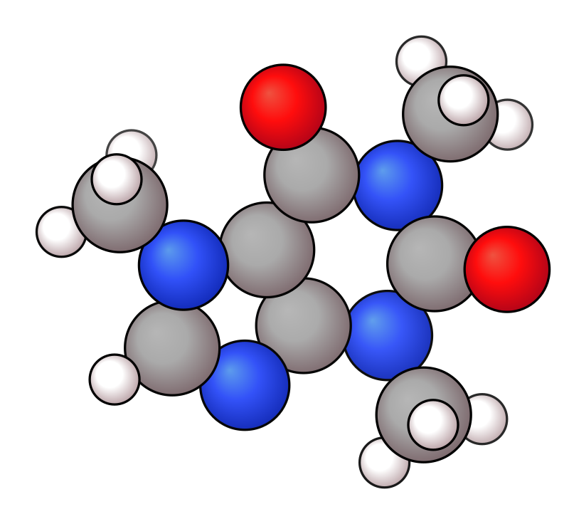

# Basics

## Presets

| Default | Flat | Paton (PyMOL-like) | Bubble |
|---------|------|-------------------|--------|
|  |  |  |  |

```bash
xyzrender caffeine.xyz                        # default
xyzrender caffeine.xyz --config flat          # flat: no gradient
xyzrender caffeine.xyz --config paton         # paton: PyMOL-style
xyzrender caffeine.xyz --config bubble --hy   # space-filling-like
```

The `paton` style is inspired by the clean styling used by [Rob Paton](https://github.com/patonlab) through PyMOL.

## Hydrogen display

| All H | Some H | No H |
|-------|--------|------|
|  |  |  |

```bash
xyzrender ethanol.xyz --hy              # all H
xyzrender ethanol.xyz --hy 7 8 9        # specific H atoms (1-indexed)
xyzrender ethanol.xyz --no-hy           # no H
```

## Bond orders

| Aromatic | Kekulé |
|----------|--------|
|  |  |

```bash
xyzrender benzene.xyz --hy              # aromatic notation (default)
xyzrender caffeine.xyz --bo -k          # Kekulé bond orders
```

## vdW spheres

| All atoms | Selected atoms | Paton style |
|-----------|---------------|-------------|
|  |  |  |

```bash
xyzrender asparagine.xyz --hy --vdw                   # all atoms
xyzrender asparagine.xyz --hy --vdw "1-6"             # atoms 1–6 only
xyzrender asparagine.xyz --hy --vdw --config paton    # paton style
```
