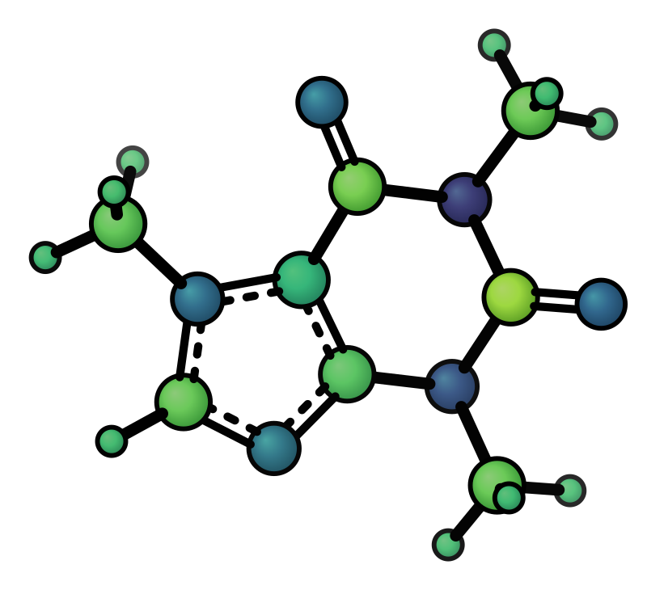
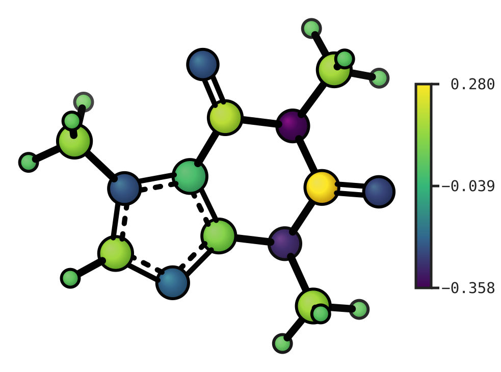

# Colormaps

## Atom property colormap (`--cmap`)

Color atoms by a per-atom scalar value (e.g. partial charges, NMR shifts, Fukui indices) using a colormap palette.

> **Python.** Most `xyzrender` flags below map 1:1 to keyword arguments on `render()`. Two shapes differ from the CLI:
>
> - `--cmap FILE` → either `cmap="charges.txt"` (path) **or** `cmap={1: 0.5, 2: -0.3}` (1-indexed dict, no file needed)
> - `--cmap-range VMIN VMAX` → `cmap_range=(-0.5, 0.5)` (tuple)
>
> ```python
> render(mol, cmap={1: 0.5, 2: -0.3, 3: 0.04}, cmap_range=(-0.5, 0.5), cbar=True)
> render(mol, cmap="charges.txt", cmap_symm=True, cmap_palette="coolwarm")
> ```

| Mulliken charges (rotation) | Symmetric range | With colorbar |
|----------------------------|----------------|---------------|
|  |  |  |

```bash
xyzrender caffeine.xyz --hy --cmap caffeine_charges.txt --gif-rot -go caffeine_cmap.gif
xyzrender caffeine.xyz --hy --cmap caffeine_charges.txt --cmap-range -0.5 0.5
xyzrender caffeine.xyz --hy --cmap caffeine_charges.txt --cbar
```

The colormap file has two columns — **1-indexed atom number** and value. Any extension works. Header lines (first token not an integer), blank lines, and `#` comment lines are silently skipped.

```text
# charges.txt
1  +0.512
2  -0.234
3   0.041
```

- Atoms **in the file**: colored by the selected palette (default: Viridis — dark purple → blue → green → bright yellow)
- Atoms **not in the file**: white (`#ffffff`). Override with `"cmap_unlabeled"` in a custom JSON preset
- Range defaults to min/max of provided values; use `--cmap-range vmin vmax` for an explicit range or `--cmap-symm` for a symmetric range about zero

| Flag | Description |
|------|-------------|
| `--cmap FILE` | Path to colormap data file (two-column: atom index, value) |
| `--cmap-range VMIN VMAX` | Override vmin/vmax for atom, bond, and ESP colorbars (e.g. `-0.5 0.5`) |
| `--cmap-symm` | Symmetric range about zero: `[-max(|v|), +max(|v|)]` |
| `--cmap-palette NAME` | Colormap palette (default: `viridis`) |
| `--cbar` | Add a vertical colorbar on the right showing the data range |
| `--label-size PT` | Font size for colorbar tick labels (and all other labels) |

Recommended palette set for `xyzrender`:

- Best for `--cmap`: `viridis`, `plasma`, `coolwarm`
- Bond order from zero: `white_reverse_plasma` (with `--cmap-range 0 3`)
- Best for ESP: `rainbow`, `coolwarm`, `RdBu`

## Bond property colormap (`--bond-cmap`)

Color **selected bonds** by a scalar (e.g. Mayer bond order, NBO occupancy). The file has three columns — **1-indexed atom i**, **atom j**, and **value**. Pairs are undirected (`2 3 v` equals `3 2 v`). Bonds not listed keep the normal bond styling. Both atoms must exist in the structure; if automatic bond detection did not add a link between them, xyzrender **logs a warning and adds a dotted NCI-style edge** so the contact can be colored (same linestyle as auto-detected NCI interactions). For Mayer tables, omit distant atom pairs in the file unless you intend to show that contact.

```text
# bond_orders.txt
14  22  0.57
14  28  0.61
```

Use the same `--cmap-range`, `--cmap-symm`, `--cmap-palette`, `--cbar`, and `--cbar-unit` flags as for atom `--cmap`. With both `--cmap` and `--bond-cmap`, the colorbar reflects the atom colormap. For rotation GIFs with a colorbar, add `--raster-fit-viewbox` so the bar is not cropped (default GIF raster is square).

```{eval-rst}
.. image:: ../../../examples/images/systems_bonds_caffeine.svg
   :width: 420px
   :align: center
```

```{eval-rst}
.. list-table::
   :widths: 25 25 25 25
   :class: colormap-gallery
   :align: center

   * - .. image:: ../../../examples/images/systems_bonds_c2h6.svg
          :width: 200px
     - .. image:: ../../../examples/images/systems_bonds_c2h4.svg
          :width: 200px
     - .. image:: ../../../examples/images/systems_bonds_c2h2.svg
          :width: 200px
     - .. image:: ../../../examples/images/systems_bonds_c4h6_double.svg
          :width: 200px
   * - .. image:: ../../../examples/images/systems_bonds_c4h6_triple.svg
          :width: 200px
     - .. image:: ../../../examples/images/systems_bonds_c4h8.svg
          :width: 200px
     - .. image:: ../../../examples/images/systems_bonds_c4h2.svg
          :width: 200px
     - .. image:: ../../../examples/images/systems_bonds_c6h6.svg
          :width: 200px
```

```bash
xyzrender examples/structures/systems_bonds/caffeine.xyz --hy --no-bo \
  --bond-cmap examples/structures/systems_bonds/caffeine_bond_orders.txt \
  --cmap-range 0 3 --cmap-palette white_reverse_plasma \
  --cbar --cbar-unit "Bond order"

xyzrender examples/structures/systems_bonds/c2h2.xyz \
  --config examples/structures/systems_bonds/render.json --hy --no-bo \
  --bond-cmap examples/structures/systems_bonds/c2h2_bond_orders.txt \
  --cmap-range 0 3 --cmap-palette white_reverse_plasma
```
